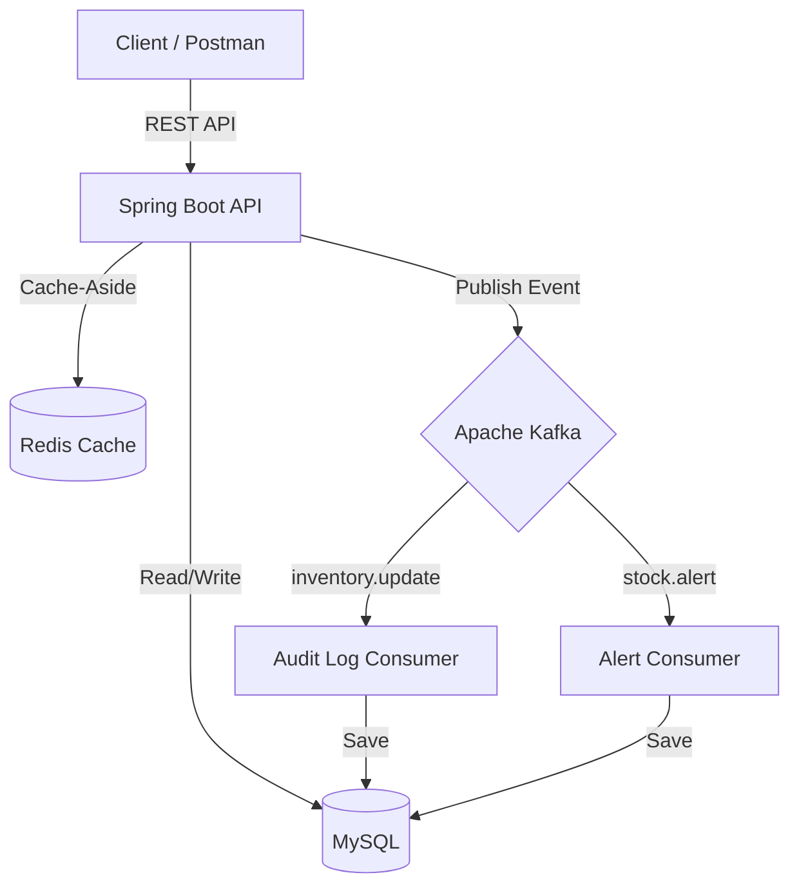

# Real-Time Inventory & Supply Chain Tracker

A production-grade, event-driven inventory tracking system engineered for high performance and scalability. This system provides real-time stock monitoring across multiple warehouses using a modern microservices-ready architecture.

## 🚀 Key Features

*   **Real-Time Event Processing**: Utilizes **Apache Kafka** for decoupled, asynchronous stock updates and alert generation.
*   **High-Performance Caching**: Implements the **Cache-Aside Pattern** with **Redis** to minimize database latency and handle high-traffic read requests.
*   **Automated Stock Alerts**: Real-time monitoring of inventory levels with automated triggers when stock falls below minimum thresholds.
*   **Scalable Data Pipeline**: Includes a robust CSV import engine for batch processing large sets of inventory data with built-in tracking.
*   **Comprehensive Audit Logs**: Every critical action is asynchronously logged via Kafka to ensure a full traceability trail without impacting API performance.

## 🏗️ System Architecture

The project follows a modern event-driven architecture designed to ensure data consistency and system resilience.



### Components:
1.  **Spring Boot API**: The core service handling REST requests and business logic.
2.  **Apache Kafka**: The event backbone. It handles `inventory.update`, `stock.alert`, and `import.events` topics.
3.  **Redis Cache**: Stores frequently accessed product and warehouse data to offload the primary database.
4.  **MySQL**: The persistent system of record for all entities and transactions.

### Event Workflow:
When a stock level is updated:
1.  The **Inventory Service** updates the MySQL database.
2.  An **InventoryUpdateEvent** is published to Kafka.
3.  The **AuditLogConsumer** asynchronously picks up the event and records it in the audit logs.
4.  If the quantity is below the threshold, a **StockAlertEvent** is triggered for immediate notification.

## 🛠️ Tech Stack

*   **Language**: Java 17 / 21
*   **Framework**: Spring Boot 3.4.x (with Spring Data JPA & Spring Kafka)
*   **Messaging**: Apache Kafka
*   **Caching**: Redis
*   **Database**: MySQL 8.0
*   **Build Tool**: Gradle

## 🚦 Getting Started

### 1. Prerequisites
*   **Docker Desktop** (for running the infrastructure)
*   **JDK 21**
*   **Postman** (for testing)

### 2. Launch Infrastructure
Start the database, message broker, and caching engine:
```bash
docker-compose up -d
```
This starts:
- **MySQL**: port 3306
- **Kafka**: port 9092
- **Redis**: port 6380
- **Kafka UI**: [http://localhost:8090](http://localhost:8090)

### 3. Run the Application
```bash
export JAVA_HOME=/path/to/your/jdk21
./gradlew bootRun
```

## 📖 API Documentation

The API is versioned (`/v1`) and follows RESTful principles.

| Feature | Method | Endpoint | Description |
| :--- | :--- | :--- | :--- |
| **Auth** | POST | `/v1/auth/login` | Authenticate and get session |
| **Products** | GET | `/v1/products` | List all available products |
| **Warehouses**| GET | `/v1/warehouses` | List all warehouse locations |
| **Inventory** | POST | `/v1/inventory` | Link a product to a warehouse |
| **Inventory** | PATCH | `/v1/inventory/{id}/quantity` | Update stock level (triggers Kafka) |
| **Transactions**| POST | `/v1/transactions` | Record a stock movement |
| **Audit** | GET | `/v1/audit-logs` | View system-wide event logs |
| **Import** | POST | `/v1/import/csv` | Batch upload inventory data |

## 🧪 Testing with Postman
A pre-configured Postman collection is included in the root directory: `postman_collection.json`.
1. Open Postman.
2. Click **Import** and select the file.
3. Ensure the **Postman Desktop Agent** is running to connect to `localhost:9000`.

# realtime-inventory-tracker
